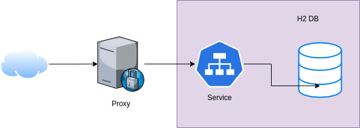

# nissumRest

Servicio web para gestion de usuarios.

## Metodos
### Crear
Uri: /add
 
Method: POST
 
Desc: Este metodo recibe un usuario con los campos "nombre", "correo", "contraseña",
más un listado de objetos "teléfono", respetando el siguiente formato:
<pre>
{
        "name": "Juan Rodriguez",
        "email": "juan@rodriguez.org",
        "password": "Apasi1asd4",
        "phones": [
            {
            "number": "1234567",
            "citycode": "1",
            "contrycode": "57"
            }
        ]
}
</pre>

 

### Actualizar
Uri: /update
 
Method: PUT
 
Dec: Este metodo recibe un usuario con los campos "id","nombre", "correo", "contraseña",
más un listado de objetos "teléfono", respetando el siguiente formato:
<pre>
{
        "id": "c5fd3517-3937-43a3-a774-5584b369befb",
        "name": "Juan Rodriguez Perez",
        "email": "juan@rodriguez.org",
        "password": "Apasi1asd4",
        "phones": [
            {
            "id": "4e3e1a5e-acf4-4477-b440-8fb191e80a06",
            "number": "1234567",
            "citycode": "1",
            "contrycode": "57"
            }
        ]
}
</pre>

### Listar
Uril: /list
 
Method: GET
 
Desc: Lista los usuarios registrados

### Get
Uril: /get/{id}
 
Method: GET
 
Desc: Muestra la informacion del el usuario al que pertenece el id del parámetro

### Delete
Uril: /delete/{id}
 
Method: DELETE
 
Desc: Elimina el usuario al que pertenece el id del parámetro.